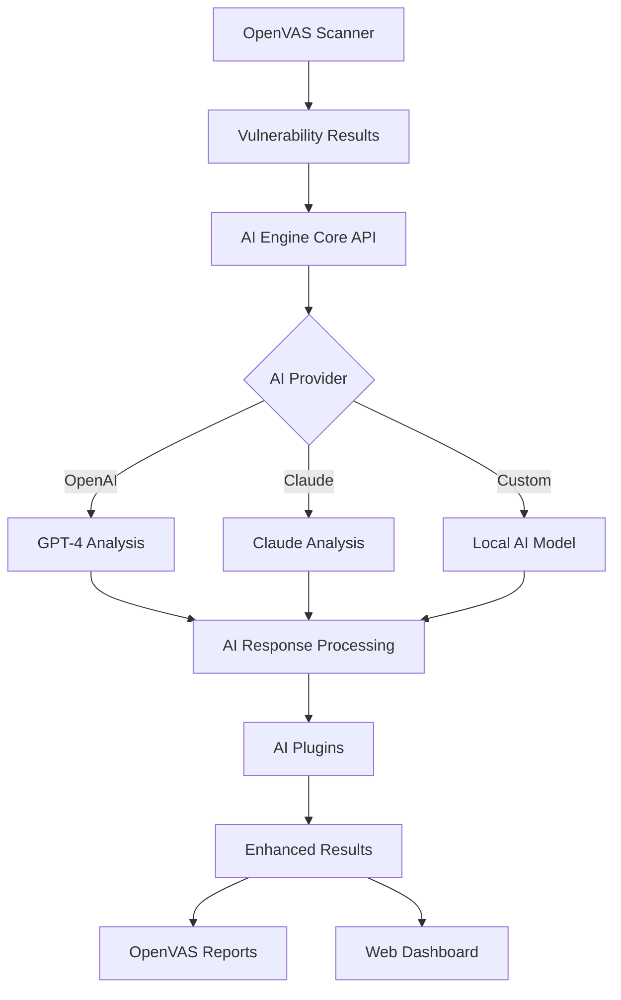

# AI-Enhanced OpenVAS

> **🎯 Project Goal**: Transform OpenVAS into an AI-powered penetration testing platform that provides intelligent vulnerability analysis, automated threat modeling, and enhanced security insights using cutting-edge AI technology.

An advanced vulnerability assessment platform that extends OpenVAS with AI-powered penetration testing capabilities, intelligent analysis, and automated threat modeling.

## 🎯 Project Objectives

### **Primary Goals**
1. **Intelligent Vulnerability Analysis**: Enhance OpenVAS scan results with AI-powered risk assessment, business impact analysis, and contextual remediation recommendations
2. **Automated Threat Modeling**: Implement AI-driven threat identification and attack vector analysis for comprehensive security assessment
3. **Smart Penetration Testing**: Develop AI agents that can suggest and automate ethical penetration testing techniques
4. **Enhanced Reporting**: Generate professional, AI-enhanced security reports with actionable insights and executive summaries

### **Technical Objectives**
- **Multi-AI Provider Support**: Integrate OpenAI, Claude, and custom AI models seamlessly
- **Modular Architecture**: Build extensible plugin system for easy feature additions
- **Enterprise Security**: Implement production-grade security for AI API communications
- **Cross-Platform Compatibility**: Support Windows, Linux, and macOS environments
- **Performance Optimization**: Ensure efficient AI processing with async operations and caching

### **Innovation Goals**
- **Custom AI Agents**: Develop specialized in-house AI models for penetration testing
- **Continuous Learning**: Implement systems that learn from scan results to improve accuracy
- **Automated Exploit Chains**: Create AI that can identify and suggest exploit sequences
- **Compliance Integration**: Align AI recommendations with industry compliance frameworks

## 🚀 Core AI Capabilities

### **Implemented Features** ✅
- **AI-Powered Vulnerability Analysis**: Enhanced risk assessment with business impact analysis
- **OpenAI Integration**: GPT-4 powered analysis and recommendations  
- **Secure API Framework**: Enterprise-grade security for AI communications
- **Plugin Architecture**: Modular system for AI-powered extensions
- **Cross-Platform Build System**: CMake-based build with dependency management

### **In Development** 🚧
- **Claude Integration**: Anthropic's Claude for advanced reasoning
- **Threat Modeling Engine**: Automated threat identification and attack vector analysis
- **Smart Scan Optimization**: AI-driven parameter tuning for improved efficiency
- **Custom AI Models**: Support for local and specialized AI implementations

### **Planned Features** 📋
- **Automated Report Generation**: Professional security reports with AI insights
- **Exploit Suggestion Engine**: Ethical penetration testing recommendations
- **Web UI Integration**: AI-enhanced dashboard and reporting interface
- **Continuous Learning**: AI models that improve from scan data

## 🏗️ Development Workflow & Setup
### **Current Status**: Phase 2 Complete ✅
- ✅ **Foundation & Research**: Repository structure, architecture analysis, integration points identified
- ✅ **AI Integration Architecture**: Core API framework, OpenAI provider, plugin system implemented
- 🚧 **Core AI Features**: Enhanced vulnerability analysis (in progress)
- 📋 **Advanced Features**: Custom AI agents, continuous learning (planned)

## 🛠️ Installation & Setup Workflow

### **Phase 1: Environment Setup**

#### **1.1 Prerequisites Installation**

**Windows (PowerShell as Administrator):**
```powershell
# Option 1: Using Chocolatey (Recommended)
Set-ExecutionPolicy Bypass -Scope Process -Force
iex ((New-Object System.Net.WebClient).DownloadString('https://community.chocolatey.org/install.ps1'))
.\deployment\scripts\install_dependencies.ps1 -UseChocolatey

# Option 2: Using vcpkg
.\deployment\scripts\install_dependencies.ps1 -UseVcpkg

# Option 3: Using Scoop
.\deployment\scripts\install_dependencies.ps1 -UseScoop
```

**Linux (Ubuntu/Debian):**
```bash
# Install system dependencies
sudo ./deployment/scripts/install_dependencies.sh

# Or manual installation
sudo apt-get update
sudo apt-get install build-essential cmake pkg-config git curl
sudo apt-get install libglib2.0-dev libjson-glib-dev libcurl4-openssl-dev
```

**macOS:**
```bash
# Install Homebrew if not present
/bin/bash -c "$(curl -fsSL https://raw.githubusercontent.com/Homebrew/install/HEAD/install.sh)"

# Install dependencies
./deployment/scripts/install_dependencies.sh
```

#### **1.2 Repository Setup**
```bash
# Clone the repository
git clone https://github.com/yourusername/ai-enhanced-openvas
cd ai-enhanced-openvas

# Set up project structure and fork OpenVAS repositories
# Windows:
.\setup_forks.ps1

# Linux/macOS:
chmod +x setup_forks.sh
./setup_forks.sh
```

### **Phase 2: Build & Configuration**

#### **2.1 Build the AI Engine**
```bash
# Create build directory
mkdir build && cd build

# Configure build (Release mode)
cmake -DCMAKE_BUILD_TYPE=Release \
      -DBUILD_AI_ENGINE=ON \
      -DBUILD_AI_PLUGINS=ON \
      -DBUILD_TESTS=ON \
      -DBUILD_EXAMPLES=ON \
      ..

# Build the project
# Linux/macOS:
make -j$(nproc)

# Windows (Visual Studio):
cmake --build . --config Release --parallel
```

#### **2.2 Run Tests**
```bash
# Run all tests
make test

# Or run specific tests
./tests/test_ai_service
./tests/test_integration
```

#### **2.3 AI Provider Configuration**

**Set up API Keys:**
```bash
# Method 1: Environment Variables (Recommended)
export OPENAI_API_KEY="sk-your-openai-api-key-here"
export ANTHROPIC_API_KEY="your-claude-api-key-here"

# Method 2: Configuration File
mkdir -p ~/.config/ai-enhanced-openvas
cat > ~/.config/ai-enhanced-openvas/ai-config.conf << EOF
[ai_providers]
openai_enabled = true
openai_api_key = sk-your-openai-api-key-here
openai_model = gpt-4
claude_enabled = false
claude_api_key = your-claude-api-key-here
EOF
```

**Windows Configuration:**
```powershell
# Set environment variables
[Environment]::SetEnvironmentVariable("OPENAI_API_KEY", "sk-your-key-here", "User")
[Environment]::SetEnvironmentVariable("ANTHROPIC_API_KEY", "your-claude-key", "User")

# Or create config file
New-Item -ItemType Directory -Path "$env:USERPROFILE\.config\ai-enhanced-openvas" -Force
@"
[ai_providers]
openai_enabled = true
openai_api_key = sk-your-openai-api-key-here
"@ | Out-File -FilePath "$env:USERPROFILE\.config\ai-enhanced-openvas\ai-config.conf"
```

### **Phase 3: Testing & Validation**

#### **3.1 Run AI Integration Demo**
```bash
# Test AI functionality with demo
./examples/ai_vulnerability_demo

# Expected output:
# ✅ AI service initialized successfully
# 🔍 Basic AI Vulnerability Analysis Demo
# 📤 Sending vulnerability data to AI for analysis...
# ✅ AI Analysis Complete!
```

#### **3.2 Integration with OpenVAS**
```bash
# Install AI engine library (optional)
sudo make install

# Configure OpenVAS to use AI features
sudo tee -a /etc/openvas/openvas.conf << EOF
# AI-Enhanced OpenVAS Configuration
ai_openai_api_key = $OPENAI_API_KEY
ai_enable_vulnerability_analysis = yes
ai_enable_threat_modeling = yes
ai_enable_scan_optimization = yes
ai_service_timeout = 30
ai_max_concurrent_requests = 4
EOF

# Restart OpenVAS services
sudo systemctl restart openvas-scanner
sudo systemctl restart gvmd
```

### **Phase 4: Development & Customization**

#### **4.1 Custom AI Provider Development**
```bash
# Create new provider
cp ai-engine/providers/openai_provider.c ai-engine/providers/custom_provider.c

# Implement provider interface
# - Modify API endpoints and authentication
# - Update request/response handling
# - Add to CMakeLists.txt

# Test new provider
./tests/test_integration
```

#### **4.2 Plugin Development**
```bash
# Create new AI plugin
mkdir plugins/my-custom-plugin
cp plugins/vulnerability-analysis/ai_vuln_analyzer.c plugins/my-custom-plugin/

# Implement plugin functionality
# - Define AI task types
# - Implement analysis logic
# - Add to build system

# Test plugin
make && ./examples/ai_vulnerability_demo
```

## 🏗️ Project Architecture

### **Repository Structure**
```
ai-enhanced-openvas/
├── 📁 core/                          # Forked OpenVAS components
│   ├── gvm-libs/                     # Core GVM libraries
│   ├── gvmd/                         # Vulnerability Manager daemon  
│   ├── openvas-scanner/              # Scanner engine
│   ├── gsa/                          # Web interface
│   └── pg-gvm/                       # PostgreSQL extension
├── 📁 ai-engine/                     # AI integration layer ⭐
│   ├── api/                          # Core AI service API
│   │   ├── ai_service.h              # Main API interface
│   │   └── ai_service.c              # Core implementation
│   ├── providers/                    # AI provider implementations
│   │   └── openai_provider.c         # OpenAI integration
│   └── models/                       # Data models for AI features
├── 📁 plugins/                       # AI-powered plugins ⭐
│   ├── vulnerability-analysis/       # Enhanced vulnerability analysis
│   ├── threat-modeling/              # AI threat modeling (planned)
│   ├── scan-optimization/            # Intelligent scan optimization (planned)
│   └── report-generation/            # AI report generation (planned)
├── 📁 deployment/                    # Deployment configurations
│   └── scripts/                      # Installation scripts
├── 📁 tests/                         # Test suites ⭐
│   ├── test_ai_service.c             # Core AI service tests
│   └── test_integration.c            # Integration tests
├── 📁 examples/                      # Working examples ⭐
│   └── ai_vulnerability_demo.c       # Complete AI demo
└── 📁 docs/                          # Documentation
    ├── DEVELOPMENT_GUIDE.md          # Development workflow
    └── ARCHITECTURE_ANALYSIS.md      # Technical architecture
```

### **AI Integration Flow**


### **Component Interaction**
```
┌─────────────────┐    ┌─────────────────┐    ┌─────────────────┐
│   OpenVAS       │───▶│   AI Engine     │───▶│  AI Providers   │
│   Components    │    │   (Core API)    │    │  (OpenAI/Claude)│
│                 │    │                 │    │                 │
│ • Scanner       │    │ • Multi-provider│    │ • OpenAI GPT-4  │
│ • GVMD          │    │ • Async/Sync    │    │ • Claude 3      │
│ • GSA           │    │ • Thread pools  │    │ • Custom models │
│ • Reports       │    │ • Security      │    │ • Local AI      │
└─────────────────┘    └─────────────────┘    └─────────────────┘
         │                       │                       │
         ▼                       ▼                       ▼
┌─────────────────┐    ┌─────────────────┐    ┌─────────────────┐
│   Enhanced      │    │   AI Plugins    │    │   Results &     │
│   Results       │    │   & Analysis    │    │   Insights      │
│                 │    │                 │    │                 │
│ • Risk scores   │    │ • Vuln analysis │    │ • Business risk │
│ • Remediation   │    │ • Threat model  │    │ • Remediation   │
│ • Business      │    │ • Scan optimize │    │ • Confidence    │
│   impact        │    │ • Report gen    │    │ • Metrics       │
└─────────────────┘    └─────────────────┘    └─────────────────┘
```

## 💻 Usage Examples & Workflow

### **Quick Start Example**
```bash
# 1. Clone and setup
git clone https://github.com/yourusername/ai-enhanced-openvas
cd ai-enhanced-openvas
./setup_forks.ps1  # Windows or ./setup_forks.sh for Linux

# 2. Install dependencies
./deployment/scripts/install_dependencies.ps1  # Windows
# or
sudo ./deployment/scripts/install_dependencies.sh  # Linux

# 3. Build
mkdir build && cd build
cmake -DCMAKE_BUILD_TYPE=Release ..
make -j$(nproc)

# 4. Configure AI
export OPENAI_API_KEY="sk-your-api-key-here"

# 5. Test
./examples/ai_vulnerability_demo
```

### **Basic AI Vulnerability Analysis**
```c
#include "ai-engine/api/ai_service.h"

int main() {
    // Initialize AI service
    if (!ai_service_init()) {
        printf("Failed to initialize AI service\n");
        return 1;
    }

    // Create vulnerability data
    JsonObject *vuln_data = json_object_new();
    json_object_set_string_member(vuln_data, "name", "SQL Injection");
    json_object_set_string_member(vuln_data, "cve", "CVE-2023-12345");
    json_object_set_string_member(vuln_data, "severity", "Critical");
    json_object_set_string_member(vuln_data, "cvss_score", "9.8");

    // Create AI request
    ai_request_t *request = ai_request_new(AI_TASK_VULNERABILITY_ANALYSIS, vuln_data);
    
    // Configure AI provider
    ai_config_t *config = ai_config_new(AI_PROVIDER_OPENAI, getenv("OPENAI_API_KEY"));
    request->config = config;

    // Process request
    printf("🔍 Analyzing vulnerability with AI...\n");
    ai_response_t *response = ai_service_process_sync(request);

    if (response->success) {
        printf("✅ AI Analysis Complete!\n");
        printf("🎯 Confidence: %.1f%%\n", response->confidence_score * 100);
        printf("📋 Analysis:\n%s\n", 
               json_object_get_string_member(response->result, "content"));
    } else {
        printf("❌ Analysis failed: %s\n", response->error_message);
    }

    // Cleanup
    ai_response_free(response);
    ai_request_free(request);
    ai_config_free(config);
    ai_service_cleanup();
    return 0;
}
```

### **Advanced Threat Modeling Workflow**
```c
// 1. System Architecture Analysis
JsonObject *system_data = json_object_new();
json_object_set_string_member(system_data, "system_type", "Web Application");
json_object_set_string_member(system_data, "architecture", "3-tier");
json_object_set_string_member(system_data, "data_classification", "Confidential");

// 2. AI Threat Analysis
ai_request_t *threat_request = ai_request_new(AI_TASK_THREAT_MODELING, system_data);
ai_response_t *threats = ai_service_process_sync(threat_request);

// 3. Vulnerability Context Enhancement
ai_request_t *vuln_request = ai_request_new(AI_TASK_VULNERABILITY_ANALYSIS, vuln_data);
ai_response_t *vuln_analysis = ai_service_process_sync(vuln_request);

// 4. Comprehensive Report Generation
JsonObject *combined_data = json_object_new();
json_object_set_object_member(combined_data, "threats", threats->result);
json_object_set_object_member(combined_data, "vulnerabilities", vuln_analysis->result);

ai_request_t *report_request = ai_request_new(AI_TASK_REPORT_GENERATION, combined_data);
ai_response_t *report = ai_service_process_sync(report_request);
```

### **Plugin Development Example**
```c
// Create custom AI plugin for compliance analysis
#include "ai-engine/api/ai_service.h"

typedef struct {
    gchar *compliance_framework;  // PCI-DSS, SOX, HIPAA, etc.
    JsonArray *requirements;
    JsonObject *scan_results;
} compliance_context_t;

ai_response_t *
ai_analyze_compliance(compliance_context_t *context)
{
    // Build compliance-specific AI request
    JsonObject *payload = json_object_new();
    json_object_set_string_member(payload, "framework", context->compliance_framework);
    json_object_set_array_member(payload, "requirements", context->requirements);
    json_object_set_object_member(payload, "scan_results", context->scan_results);
    
    // Create AI request with compliance context
    ai_request_t *request = ai_request_new(AI_TASK_VULNERABILITY_ANALYSIS, payload);
    request->context = g_strdup_printf(
        "Analyze vulnerabilities for %s compliance. "
        "Provide specific compliance violations, risk ratings, "
        "and remediation steps aligned with framework requirements.",
        context->compliance_framework
    );
    
    // Process with AI
    return ai_service_process_sync(request);
}
```

## 🚀 Development Roadmap & Progress

### **✅ Phase 1: Foundation & Research (COMPLETE)**
- [x] **Repository Setup**: Forked all core OpenVAS/Greenbone repositories
- [x] **Development Environment**: Cross-platform build system with CMake
- [x] **Architecture Analysis**: Detailed analysis of OpenVAS components
- [x] **Integration Points**: Identified optimal AI integration locations
- [x] **Documentation**: Comprehensive development guides and API docs

### **✅ Phase 2: AI Integration Architecture (COMPLETE)**
- [x] **Core AI Service**: Multi-provider API framework with async/sync processing
- [x] **OpenAI Provider**: Complete GPT-4 integration with secure API handling
- [x] **Plugin System**: Modular architecture for AI-powered extensions
- [x] **Security Framework**: Enterprise-grade security for AI communications
- [x] **Build System**: Cross-platform CMake with dependency management
- [x] **Test Suite**: Comprehensive unit and integration tests

### **🚧 Phase 3: Core AI Features (IN PROGRESS)**
- [x] **Enhanced Vulnerability Analysis**: AI-powered risk assessment with business impact
- [ ] **Claude Provider**: Anthropic's Claude integration for advanced reasoning
- [ ] **Threat Modeling Engine**: Automated threat identification and attack vectors
- [ ] **Scan Optimization**: AI-driven parameter tuning for efficiency
- [ ] **Report Generation**: Professional AI-enhanced security reports

### **📋 Phase 4: Advanced Features (PLANNED)**
- [ ] **Custom AI Agents**: Specialized in-house AI models for penetration testing
- [ ] **Exploit Suggestion Engine**: Ethical penetration testing recommendations
- [ ] **Continuous Learning**: AI models that improve from scan data
- [ ] **Web UI Integration**: AI-enhanced dashboard and reporting interface
- [ ] **Compliance Integration**: Automated compliance checking and reporting

### **🎯 Phase 5: Enterprise Features (FUTURE)**
- [ ] **Multi-Tenant Support**: Enterprise-grade multi-organization support
- [ ] **Role-Based Access Control**: Granular permissions for AI features
- [ ] **Audit Logging**: Comprehensive logging for compliance and security
- [ ] **Performance Optimization**: Advanced caching and optimization
- [ ] **API Gateway**: RESTful API for third-party integrations

## 🛠️ Development Workflow

### **For Contributors**
```bash
# 1. Fork and clone
git clone https://github.com/yourusername/ai-enhanced-openvas
cd ai-enhanced-openvas

# 2. Create feature branch
git checkout -b feature/my-ai-enhancement

# 3. Set up development environment
./deployment/scripts/install_dependencies.sh
mkdir build && cd build
cmake -DCMAKE_BUILD_TYPE=Debug -DBUILD_TESTS=ON ..
make -j$(nproc)

# 4. Run tests
make test

# 5. Develop and test
# - Add new features to appropriate directories
# - Write tests for new functionality
# - Update documentation

# 6. Submit pull request
git add .
git commit -m "Add: New AI feature description"
git push origin feature/my-ai-enhancement
```

### **For AI Provider Integration**
```bash
# 1. Create new provider
cp ai-engine/providers/openai_provider.c ai-engine/providers/my_provider.c

# 2. Implement provider interface
# - Update API endpoints and authentication
# - Modify request/response handling
# - Add provider-specific configuration

# 3. Add to build system
# Edit ai-engine/CMakeLists.txt to include new provider

# 4. Test integration
./tests/test_integration
./examples/ai_vulnerability_demo
```

### **For Plugin Development**
```bash
# 1. Create plugin directory
mkdir plugins/my-custom-plugin

# 2. Implement plugin
# - Use vulnerability-analysis plugin as template
# - Define AI task types and processing logic
# - Add integration with OpenVAS components

# 3. Add to build system
# Edit plugins/CMakeLists.txt

# 4. Test plugin
make && ./examples/ai_vulnerability_demo
```

## 🔒 Security & Compliance

### **Security Framework**
- **🔐 API Key Security**: Secure storage with environment variables and encrypted config files
- **🛡️ Data Privacy**: Automatic sanitization of PII and sensitive data before AI processing
- **⚡ Rate Limiting**: Intelligent throttling to prevent API abuse and manage costs
- **📊 Audit Trails**: Comprehensive logging of all AI interactions for compliance
- **🎯 Ethical AI**: Built-in safeguards for responsible penetration testing

### **Enterprise Security Features**
```bash
# Secure configuration example
export AI_SERVICE_ENCRYPT_CONFIG=true
export AI_SERVICE_LOG_LEVEL=INFO
export AI_SERVICE_AUDIT_ENABLED=true

# Data sanitization settings
ai_sanitize_ip_addresses = true
ai_sanitize_hostnames = true
ai_sanitize_credentials = true
ai_max_data_size = 1MB
```

### **Compliance Support**
- **PCI-DSS**: Payment card industry compliance analysis
- **HIPAA**: Healthcare data protection assessment
- **SOX**: Sarbanes-Oxley compliance checking
- **GDPR**: Data protection regulation alignment
- **ISO 27001**: Information security management

## 📚 Documentation & Resources

### **Core Documentation**
- 📖 [**Development Guide**](docs/DEVELOPMENT_GUIDE.md) - Complete setup and development workflow
- 🏗️ [**Architecture Analysis**](docs/ARCHITECTURE_ANALYSIS.md) - Technical architecture and design decisions
- 🔧 [**API Reference**](docs/API_REFERENCE.md) - Comprehensive AI service API documentation
- 🧩 [**Plugin Development**](docs/PLUGIN_DEVELOPMENT.md) - Creating custom AI-powered plugins

### **Examples & Tutorials**
- 💡 [**Examples Directory**](examples/) - Working code examples and demonstrations
- 🎯 [**AI Demo Program**](examples/ai_vulnerability_demo.c) - Complete AI integration showcase
- 📋 [**Usage Examples**](examples/README_EXAMPLES.md) - Step-by-step usage guides

### **Project Status**
- 📊 [**Current Status**](STATUS.md) - Detailed project progress and achievements
- 🗂️ [**Project Structure**](PROJECT_STRUCTURE.md) - Repository organization and components

## 🤝 Contributing & Community

### **How to Contribute**
1. **🍴 Fork** the repository on GitHub
2. **🌿 Create** a feature branch: `git checkout -b feature/amazing-ai-enhancement`
3. **💻 Develop** following our coding standards and security guidelines
4. **🧪 Test** your changes with our comprehensive test suite
5. **📝 Document** new features and update relevant documentation
6. **🚀 Submit** a pull request with detailed description

### **Contribution Areas**
- **🤖 AI Providers**: Integrate new AI services (Claude, Cohere, local models)
- **🔌 Plugins**: Develop specialized AI-powered security analysis plugins
- **🌐 Web UI**: Enhance the web interface with AI features
- **📊 Analytics**: Add AI-driven security metrics and dashboards
- **🔧 Performance**: Optimize AI processing and caching mechanisms

### **Development Standards**
- **Code Quality**: Follow C11 standards with comprehensive error handling
- **Security First**: All AI integrations must follow security best practices
- **Test Coverage**: New features require unit and integration tests
- **Documentation**: Update docs for all user-facing changes

## 🏆 Project Goals & Vision

### **Short-term Goals (Next 6 months)**
- ✅ Complete Phase 3: Core AI features implementation
- 🎯 Add Claude and local AI model support
- 🔧 Implement advanced threat modeling capabilities
- 📊 Create AI-enhanced reporting dashboard

### **Long-term Vision (1-2 years)**
- 🤖 **AI-First Security**: Make AI the primary driver of vulnerability analysis
- 🌐 **Community Platform**: Build ecosystem of AI security plugins and models
- 🏢 **Enterprise Ready**: Full enterprise features with multi-tenancy and RBAC
- 🔬 **Research Hub**: Advance AI applications in cybersecurity research

## 📄 License & Legal

This project is licensed under the **GPL-2.0-or-later** license - see the [COPYING](COPYING) file for details.

### **Third-Party Licenses**
- OpenVAS components: Various open source licenses
- AI Provider APIs: Subject to respective terms of service
- Dependencies: See individual package licenses

## 🙏 Acknowledgments

- **🏢 Greenbone Networks** - Original OpenVAS platform and continued innovation
- **🤖 OpenAI & Anthropic** - AI provider APIs and cutting-edge language models  
- **👥 Cybersecurity Community** - Continuous feedback, testing, and contributions
- **💻 Open Source Contributors** - Everyone who helps make this project better

## 📞 Support & Community

### **Get Help**
- **🐛 Bug Reports**: [GitHub Issues](https://github.com/yourusername/ai-enhanced-openvas/issues)
- **💬 Discussions**: [GitHub Discussions](https://github.com/yourusername/ai-enhanced-openvas/discussions)
- **📖 Documentation**: [Project Wiki](https://github.com/yourusername/ai-enhanced-openvas/wiki)
- **📧 Email**: [security@ai-enhanced-openvas.org](mailto:security@ai-enhanced-openvas.org)

### **Community Channels**
- **💬 Discord**: [AI-Enhanced OpenVAS Community](https://discord.gg/ai-openvas)
- **🐦 Twitter**: [@AIOpenVAS](https://twitter.com/AIOpenVAS)
- **📺 YouTube**: [AI-Enhanced OpenVAS Channel](https://youtube.com/c/AIOpenVAS)

---

## ⚠️ Important Disclaimers

**🔒 Security Testing Only**: This tool is designed exclusively for authorized penetration testing and security assessment. Users must ensure compliance with all applicable laws and regulations.

**🤖 AI Limitations**: AI-generated analysis should be validated by security professionals. AI recommendations are advisory and require human oversight.

**🔑 API Costs**: Using external AI providers may incur costs. Monitor your usage and set appropriate limits.

**📊 Data Privacy**: Be mindful of data sent to external AI providers. Use local models for sensitive environments.

---

**🚀 Ready to revolutionize vulnerability assessment with AI? Let's build the future of cybersecurity together!**
